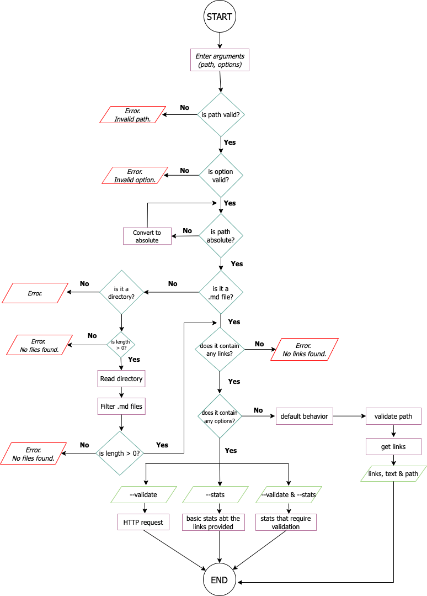

# Markdown Links

A través de JavaScript, node.js y npm, estructuré el proyecto "md-links", el cual ayudará a leer y analizar archivos en formato Markdown, para verificar los links que contengan y reportar algunas estadísticas.

## Índice

* [i. Acerca de MD-Links](#1-acerca-de-md-links)
* [ii. Resumen del proyecto](#2-resumen-del-proyecto)
* [iii. ¿Cómo se instala?](#3-como-se-instala)
* [iv. Diagrama de flujo](#4-diagrama-de-flujo)
* [v. Consideraciones generales](#5-consideraciones-generales)
* [vi. Archivos del proyecto](#5-archivos-del-proyecto)


***

## i. Acerca de md-links

[Markdown](https://es.wikipedia.org/wiki/Markdown) es un lenguaje de marcado
ligero muy popular entre developers. Es usado en muchísimas plataformas que
manejan texto plano (GitHub, foros, blogs, ...) y es muy común
encontrar varios archivos en ese formato en cualquier tipo de repositorio
(empezando por el tradicional `README.md`).

Estos archivos `Markdown` normalmente contienen _links_ (vínculos/ligas) que
muchas veces están rotos o ya no son válidos y eso perjudica mucho el valor de
la información que se quiere compartir.

Para este proyecto, se creó una
herramienta usando [Node.js](https://nodejs.org/), que soluciona este problema leyendo y analizando archivos en formato `Markdown`, para verificar los links que contengan y reportar algunas estadísticas.

## ii. Resumen del proyecto

En este proyecto se creó una herramienta de línea de comando (CLI) así como una librería (o biblioteca) en JavaScript.

## iii. ¿Cómo se instala?

En la terminal escribe el siguiente comando: 
` npm i md-links-dc `

## iv. Digrama de flujo



## v. Consideraciones generales

* La librería y el script ejecutable (herramienta de línea de comando - CLI) están implementados en JavaScript para ser ejecutados con Node.js.

## vi. Archivos del proyecto
### Este proyecto consta de dos partes

### 1) JavaScript API

El módulo puede importarse en otros scripts de Node.js y ofrece la
siguiente interfaz:

#### `mdLinks(path, options)`

#### Argumentos

* `path`: Ruta **absoluta** o **relativa** al **archivo** o **directorio**.
Si la ruta pasada es relativa, se resuelve como absoluta al directorio
desde donde se invoca node - _current working directory_).
* `options`: Un objeto con la siguiente propiedad:
  - `validate`: Booleano que determina si se desean validar los links
    encontrados.

#### Valor de retorno

La función **retorna una promesa** (`Promise`) que **resuelve a un arreglo**
(`Array`) de objetos (`Object`), donde cada objeto representa un link y contiene
las siguientes propiedades:

Con `validate:false` :

* `href`: URL encontrada.
* `text`: Texto que aparecía dentro del link (`<a>`).
* `file`: Ruta del archivo donde se encontró el link.

Con `validate:true` :

* `href`: URL encontrada.
* `text`: Texto que aparecía dentro del link (`<a>`).
* `file`: Ruta del archivo donde se encontró el link.
* `status`: Código de respuesta HTTP.
* `ok`: Mensaje `fail` en caso de fallo u `ok` en caso de éxito.

#### Ejemplo (resultados como comentarios)

```js
const mdLinks = require("md-links");

mdLinks("./some/example.md")
  .then(links => {
    // => [{ href, text, file }, ...]
  })
  .catch(console.error);

mdLinks("./some/example.md", { validate: true })
  .then(links => {
    // => [{ href, text, file, status, ok }, ...]
  })
  .catch(console.error);

mdLinks("./some/dir")
  .then(links => {
    // => [{ href, text, file }, ...]
  })
  .catch(console.error);
```

### 2) CLI (Command Line Interface - Interfaz de Línea de Comando)

El ejecutable de la aplicación se puede ejecutar de la siguiente
manera a través de la **terminal**:

`md-links <path-to-file> [options]`

Por ejemplo:

```sh
$ md-links ./some/example.md
./some/example.md http://algo.com/2/3/ Link a algo
./some/example.md https://otra-cosa.net/algun-doc.html algún doc
./some/example.md http://google.com/ Google
```

El comportamiento por defecto no valida si las URLs responden ok o no,
solo identifica el archivo markdown (a partir de la ruta que recibe como
argumento), analiza el archivo Markdown e imprime los links que vaya
encontrando, junto con la ruta del archivo donde aparece y el texto
que hay dentro del link (truncado a 50 caracteres).

#### Options

##### `--validate`

Si pasamos la opción `--validate`, el módulo hace una petición HTTP para
averiguar si el link funciona o no. Si el link resulta en una redirección a una
URL que responde ok, entonces consideraremos el link como ok.

Por ejemplo:

```sh
$ md-links ./some/example.md --validate
./some/example.md http://algo.com/2/3/ ok 200 Link a algo
./some/example.md https://otra-cosa.net/algun-doc.html fail 404 algún doc
./some/example.md http://google.com/ ok 301 Google
```

Vemos que el _output_ en este caso incluye la palabra `ok` o `fail` después de
la URL, así como el status de la respuesta recibida a la petición HTTP a dicha
URL.

##### `--stats`

Si pasamos la opción `--stats` el output (salida) será un texto con estadísticas
básicas sobre los links.

```sh
$ md-links ./some/example.md --stats
Total: 3
Unique: 3
```

También podemos combinar `--stats` y `--validate` (sin importar el orden) para obtener estadísticas que
necesiten de los resultados de la validación.

```sh
$ md-links ./some/example.md --stats --validate
Total: 3
Unique: 3
Broken: 1
```

💻 Deploy: https://www.npmjs.com/package/md-links-dc